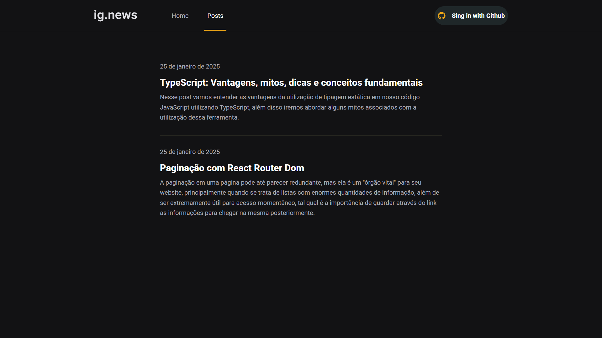

 

---

### Descrição

Este projeto é um projeto desenvolvido utilizando o Framework <a href="https://nextjs.org/">Next.js</a>, e com ele construí uma aplicação que possui como domínio a assinatura de blog. Na qual o usuário deve assinar um plano para ter acesso completo ao conteúdo de cada post dentro do blog.

Para construir algo que parece complexo, estudei e utilizei diversos conceitos importantes dentro do ecossistema do front-end. Para login, desenvolvi, utilizando o NextAuth uma conexão usando a conta do GitHub do usuário de forma que ele permanece logado mesmo restartando a aplicação ou fechando a aba da página. Para o uso de dados dentro do browser, utilizei da melhor maneira possível os conceitos de SSG (Static Site Generation) que gera páginas estáticas no momento da construção do site, SSR (Server-Side Rendering) que renderiza as páginas no servidor a cada requisição ou API Routes que permite a criação de endpoints no backend para manipulação de dados. Utilizei o Firebase para gerenciar operações serverless, o que trouxe mais flexibilidade e escalabilidade ao projeto. Para os pagamentos, optei pelo Stripe, proporcionando uma integração segura e fácil de usar para transações financeiras.

### Tecnologias utilizadas no projeto

- NodeJs
- Next.js
- Stripe
- SASS
- Typescript
- Firebase
- OAuth

  Entre outros

---

## Home

## POST

## Preview Posts

## Slug Post

